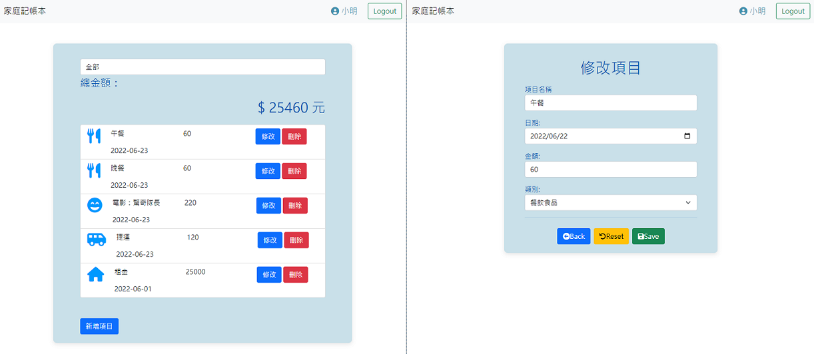

# Expense-Tracker
A web app to manage personal expenses.  
Check it out: https://fierce-basin-30554.herokuapp.com  

## Features  
### User Account related  
:star: Login / register via Facebook or Google.  
:star: Enable to update user's name or password.  
:star: Show dismissible success or error message block while login, register or account edit.)  

  

### Expense record list related  
:star: Shows users own expense list.  
:star: Show expense records with selected category.  
:star: Show total amount for listed items.  
:star: Add, edit, delete expense record if needed.  

  

### Others  
:star: Support MongoDB to manage data.  
:star: Use Passport.js to support authentication.  

## Getting Started  
### Prerequisites  
* Be sure that Node.js and npm are installed already.  
* If using `npm run dev` command, [nodemon](https://www.npmjs.com/package/nodemon) must be pre-installed.  

### Installing  
* Clone or download the project to your local machine.  
```bash
# folder_name(optional) will create a new folder in your pwd.
git clone <folder_name> https://github.com/ritachien/expense-tracker.git
```
* Get into your project folder by `Terminal` and run:  
```bash
npm install
```

### How to use  
* Create a `.env` file in root, and add content to it. The needed variables are listed in `.env.example` file.  
* Run the following command after install finished.  
```bash
# seeders: 2 users with 5 expense records of each.
npm run seed

# start the app
# Be sure your current working directory is root, or it might cause some path loading error!
npm run start
```
* Open browser to the URL if you see following message in console.  
```bash
Listening on http://localhost:3000
```
* Stop the app by `Ctrl + c`  

## Built With
* Runtime: node@16.14.2  
* Framework: express@4.18.1  
* Database: mongoose@6.4.0  
* View Engine: express-handlebars@6.0.6  
* Authentication: passport.js@0.6.0


Other dependencies are listed in package.json


## Authors
* [**Rita Chien**](https://github.com/ritachien) 
